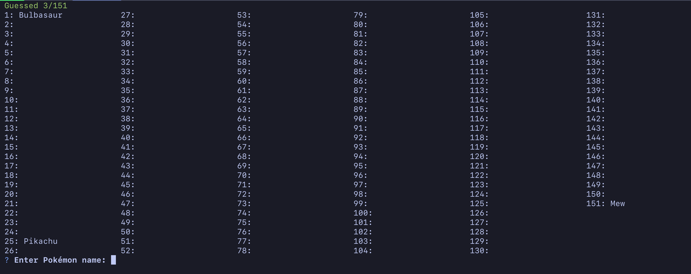

# PokéGuessr

As will all other adults I expect, I find it useful to refresh my memory of the
original 151 Pokémon from time to time. This is a little CLI version of a
guessing game that helps you with that task.

## Usage

It's built with Node.JS, so you can either just run `node ./cli.js` in the
directory, or run `npm link`, and then you can access the game via `pokeguessr`.

## Screenshot

Here's what it looks like:

